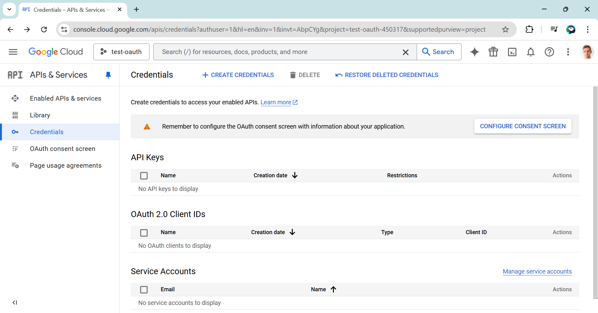
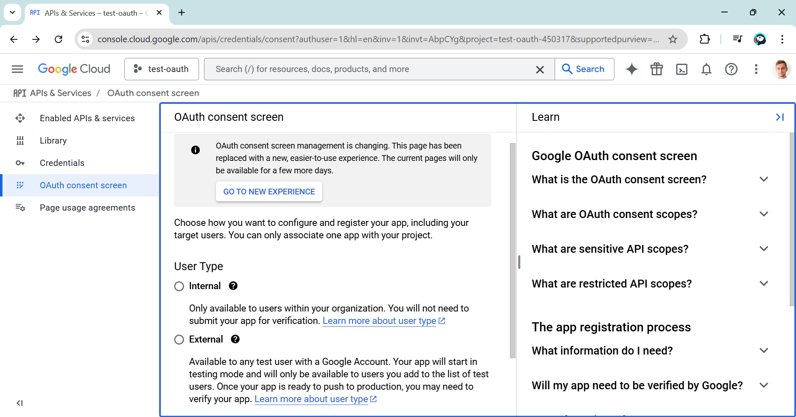
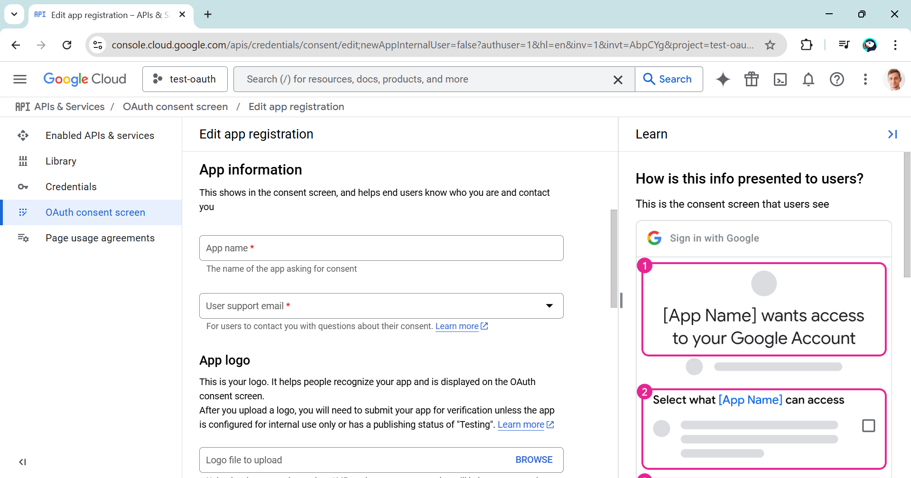
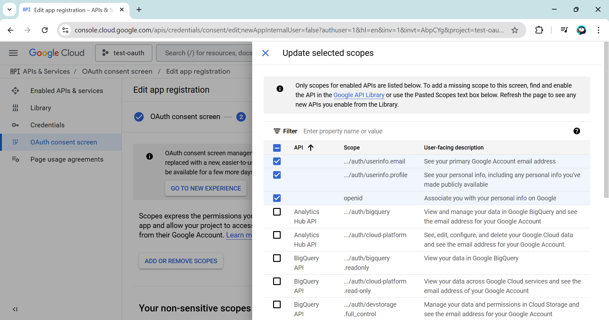
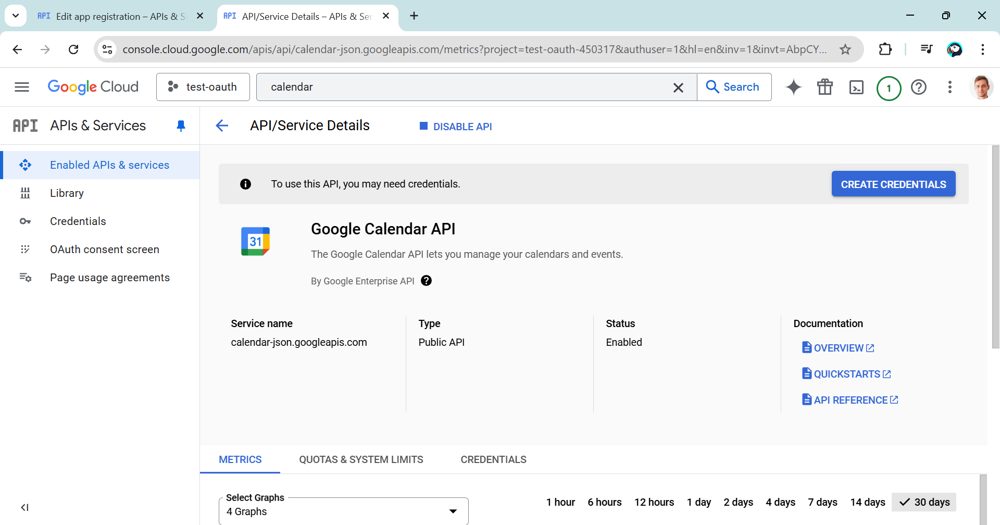
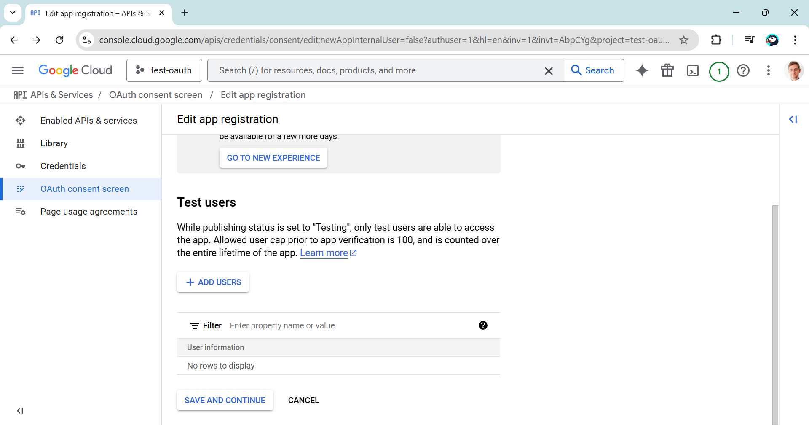
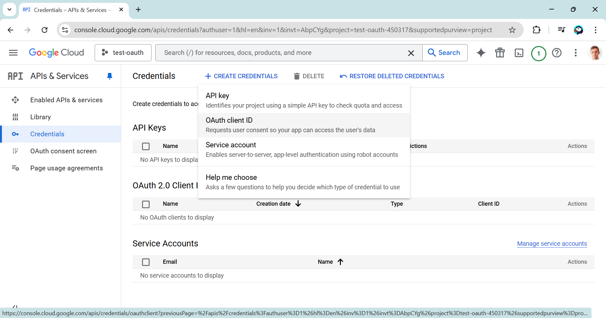
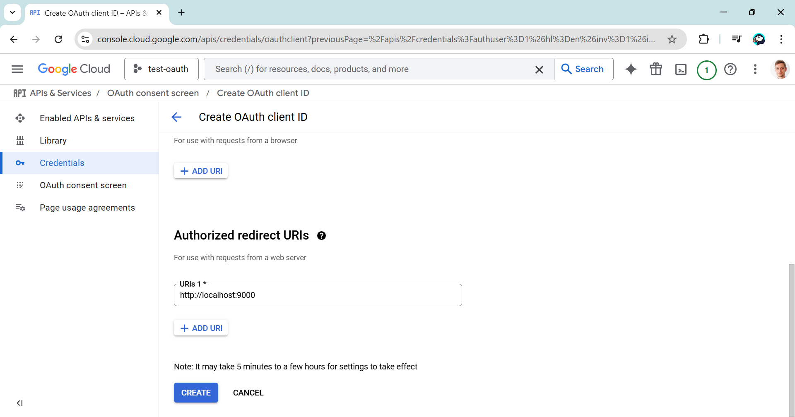
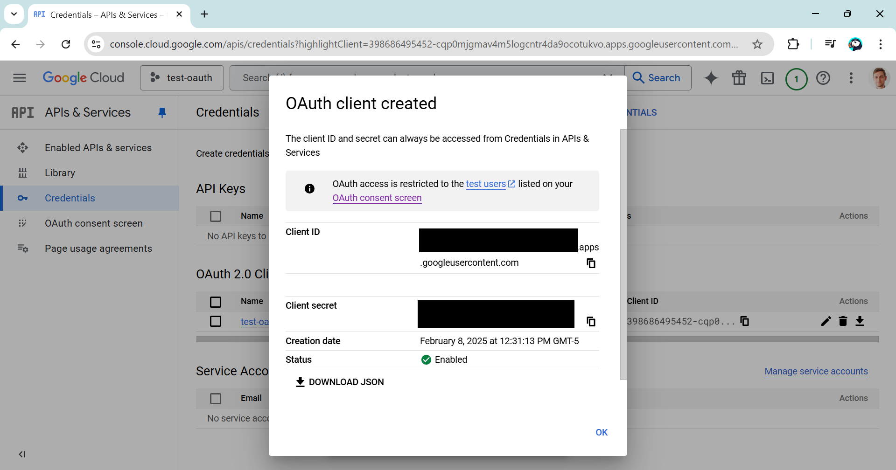

# Streamlit Auth 🔒

**Setting Up Google Authentication**
1. Create Google Cloud Credentials:
    - Go to Google Cloud’s API & Services → Credentials.
    - Configure OAuth consent screen (app metadata, scopes).
    - Select required scopes (e.g., OpenID, email, profile, Google Calendar).
    - Verification is required if using sensitive scopes.





<!--  -->


2. Create OAuth Client ID:
    - Set up credentials for a web application.
    - Define a callback URL (e.g., http://localhost:8501/oauth2callback).
    - Store client ID and secret in Streamlit’s secrets file.






3. Create the secrets configuration file:
    - Create a file named `secrets.toml` in the `.streamlit/` directory.
    - Add the client ID and secret to the file, as well as redirect_uri.
    - Add the file to `.gitignore`.

```toml
[auth]
redirect_uri = "http://localhost:8501/oauth2callback"
cookie_secret = "YOUR_RANDOM_SECRET_KEY"
client_id = "YOUR_CLIENT_ID"
client_secret = "YOUR_CLIENT_SECRET"
server_metadata_url = "https://accounts.google.com/.well-known/openid-configuration"
```

Resources:
- [st.login](https://docs.streamlit.io/develop/api-reference/user/st.login)
- [Streamlit 1.42.0 release note](https://docs.streamlit.io/develop/quick-reference/release-notes#version-1420-latest)
- [Fanilo - I Tried Adding Google Auth To a Streamlit App (It Didn't Go Well)](https://www.youtube.com/watch?v=0M4K53XBsjo&ab_channel=FaniloAndrianasolo)